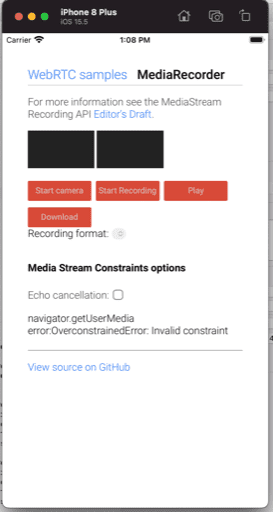
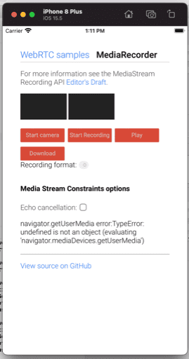

## ios-wkwebview-navigator-mediadevices-api-test

`Navigator.mediaDevices` API only available after adding permissions `NSMicrophoneUsageDescription` and `NSCameraUsageDescription` to `Info.plist`

Info.plist

```

	<key>NSMicrophoneUsageDescription</key>
	<string>xxxxx requires access to microphone.</string>
	<key>NSCameraUsageDescription</key>
	<string>xxxxx requires access to camera.</string>

```

ViewController.switft

```
//
//  ViewController.swift
//  wkwebview
//
//  Created by Afrar Malakooth on 6/5/20.
//

import UIKit
import WebKit

class ViewController: UIViewController, WKNavigationDelegate {
    var webView: WKWebView!

    override func loadView() {
        let config = WKWebViewConfiguration()
        config.allowsInlineMediaPlayback = true
        webView = WKWebView(frame: .zero, configuration: config)
        webView.configuration.allowsInlineMediaPlayback = true
        webView.allowsBackForwardNavigationGestures = true
        webView.navigationDelegate = self

        view = webView
    }

    override func viewDidLoad() {
        super.viewDidLoad()
        let url = URL(string: "https://webrtc.github.io/samples/src/content/getusermedia/record/")!
        webView.load(URLRequest(url: url))

    }


}


```

## Screenshots

With permission added



Without permission added


